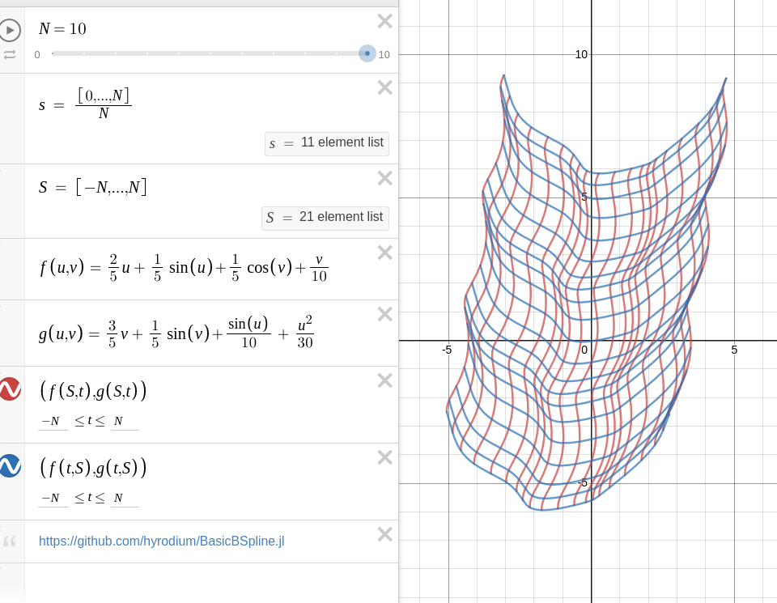

# BasicBSpline.jl

Basic operations for B-spline functions and related things with julia

[](https://hyrodium.github.io/BasicBSpline.jl/stable)
[](https://hyrodium.github.io/BasicBSpline.jl/dev)
[](https://github.com/hyrodium/BasicBSpline.jl/actions)
[](https://zenodo.org/badge/latestdoi/258791290)


## Summary
This package provides basic (mathematical) operations for [B-spline](https://en.wikipedia.org/wiki/B-spline).

* B-spline basis function
* Some operations for knot vector
* B-spline manifold (includes curve, surface and solid)
* Refinement for B-spline manifold
* Fitting control points for B-spline manifold

## Comparison to other julia packages for B-spline
* [Interpolations.jl](https://github.com/JuliaMath/Interpolations.jl)
    * >Currently this package's support is best for B-splines and also supports irregular grids.
    * But seems like no method for B-spline manifold.
* [ApproXD.jl](https://github.com/floswald/ApproXD.jl)
    * Its functions are similar to Interpolations.jl.
* [Dierckx.jl](https://github.com/kbarbary/Dierckx.jl)
    * Wrapper for the dierckx Fortran library.
    * Only 1-d or 2-d B-spline manifold are supported.
    * 5 or less degree of polynomial are supported.
* **[BasicBSpline.jl](https://github.com/hyrodium/BasicBSpline.jl) (this package)**
    * Any degree of polynomial are supported.
    * Any dimension are supported.
    * Fast implementation for lower degree (≤ 5) and dimension (≤ 3).
    * Refinement algorithm for B-spline manifold.
    * Fitting algorithm by least squares.

## Installation
Install this package

```julia
pkg> add BasicBSpline
```

To export graphics, use [ExportNURBS.jl](https://github.com/hyrodium/ExportNURBS.jl).

```julia
pkg> add https://github.com/hyrodium/ExportNURBS.jl
```

## Example
### B-spline function

```julia
using BasicBSpline
using Plots
gr()

k = Knots([0.00,1.50,2.50,5.50,8.00,9.00,9.50,10.0])
P0 = BSplineSpace(0,k) # 0th degree piecewise polynomial space
P1 = BSplineSpace(1,k) # 1st degree piecewise polynomial space
P2 = BSplineSpace(2,k) # 2nd degree piecewise polynomial space
P3 = BSplineSpace(3,k) # 3rd degree piecewise polynomial space
plot(
    plot([t->bsplinebasis(i,P0,t) for i in 1:dim(P0)], 0, 10, ylims=(0,1), legend=false),
    plot([t->bsplinebasis(i,P1,t) for i in 1:dim(P1)], 0, 10, ylims=(0,1), legend=false),
    plot([t->bsplinebasis(i,P2,t) for i in 1:dim(P2)], 0, 10, ylims=(0,1), legend=false),
    plot([t->bsplinebasis(i,P3,t) for i in 1:dim(P3)], 0, 10, ylims=(0,1), legend=false),
    layout=(2,2),
)
```


Try [interactive graph with Desmos graphing calculator](https://www.desmos.com/calculator/ql6jqgdabs)!

### B-spline manifold
```julia
using BasicBSpline
using ExportNURBS

p = 2 # degree of polynomial
k = Knots(1:8) # knot vector
P = BSplineSpace(p,k) # B-spline space
rand_a = [rand(2) for i in 1:dim(P), j in 1:dim(P)]
a = [[2*i-6.5,2*j-6.5] for i in 1:dim(P), j in 1:dim(P)] + rand_a # random generated control points
M = BSplineManifold([P,P],a) # Define B-spline manifold
save_png("2dim.png", M) # save image
```


### Refinement
#### h-refinemnet
```julia
k₊=[Knots(3.3,4.2),Knots(3.8,3.2,5.3)] # additional knots
M′ = refinement(M,k₊=k₊) # refinement of B-spline manifold
save_png("2dim_h-refinement.png", M′) # save image
```


Note that this shape and the last shape are identical.

#### p-refinemnet
```julia
p₊=[1,2] # additional degrees
M′ = refinement(M,p₊=p₊) # refinement of B-spline manifold
save_png("2dim_p-refinement.png", M′) # save image
```


Note that this shape and the last shape are identical.

### Fitting B-spline manifold
[Try on Desmos graphing graphing calculator!](https://www.desmos.com/calculator/2hm3b1fbdf)
```julia
p1 = 2
p2 = 2
k1 = Knots(-10:10)+p1*Knots(-10,10)
k2 = Knots(-10:10)+p2*Knots(-10,10)
P1 = FastBSplineSpace(p1, k1)
P2 = FastBSplineSpace(p2, k2)

f(u1, u2) = [2u1 + sin(u1) + cos(u2) + u2 / 2, 3u2 + sin(u2) + sin(u1) / 2 + u1^2 / 6] / 5

a = fittingcontrolpoints(f, P1, P2)
M = BSplineManifold([P1,P2],a)
save_png("fitting.png", M, unitlength=50, up=10, down=-10, left=-10, right=10)
```



If the knots span is too coarse, the approximation will be coarse.
```julia
p1 = 2
p2 = 2
k1 = Knots(-10:5:10)+p1*Knots(-10,10)
k2 = Knots(-10:5:10)+p2*Knots(-10,10)
P1 = FastBSplineSpace(p1, k1)
P2 = FastBSplineSpace(p2, k2)

f(u1, u2) = [2u1 + sin(u1) + cos(u2) + u2 / 2, 3u2 + sin(u2) + sin(u1) / 2 + u1^2 / 6] / 5

a = fittingcontrolpoints(f, P1, P2)
M = BSplineManifold([P1,P2],a)
save_png("fitting_coarse.png", M, unitlength=50, up=10, down=-10, left=-10, right=10)
```


### Draw smooth vector graphics
```julia
p = 3
k = Knots(range(-2π,2π,length=8))+p*Knots(-2π,2π)
P = FastBSplineSpace(p, k)

f(u) = [u,sin(u)]

a = fittingcontrolpoints(f, P)
M = BSplineManifold([P],a)
save_svg("sine_curve.svg", M, unitlength=50, up=2, down=-2, left=-8, right=8)
```


This is useful when you edit graphs (or curves) with your favorite vector graphics editor.

## References
If you use BasicBSpline.jl in your work, please consider citing it by

```bibtex
@misc{hyrodium:2020:BasicBSpline,
  title={BasicBSpline.jl: Basic operations for B-spline functions and related things with julia},
  author={Yuto Horikawa},
  year={2020},
  howpublished={\url{https://hyrodium.github.io/BasicBSpline.jl/stable/}},
  doi={10.5281/zenodo.4356869}
}
```
