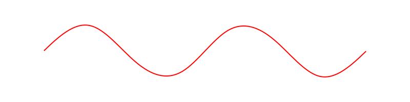

# BasicBSpline.jl

Basic (mathematical) operations for B-spline functions and related things with Julia.

[](https://hyrodium.github.io/BasicBSpline.jl/stable)
[](https://hyrodium.github.io/BasicBSpline.jl/dev)
[](https://github.com/hyrodium/BasicBSpline.jl/actions)
[](https://codecov.io/gh/hyrodium/BasicBSpline.jl)
[](https://github.com/JuliaTesting/Aqua.jl)
[](https://zenodo.org/badge/latestdoi/258791290)
[](https://pkgs.genieframework.com?packages=BasicBSpline)


## Summary
This package provides basic mathematical operations for [B-spline](https://en.wikipedia.org/wiki/B-spline).

* B-spline basis function
* Some operations for knot vector
* Some operations for B-spline space (piecewise polynomial space)
* B-spline manifold (includes curve, surface and solid)
* Refinement algorithm for B-spline manifold
* Fitting control points for a given function

## Comparison to other B-spline packages
There are several Julia packages for B-spline, and this package distinguishes itself with the following key benefits:

* Supports all degrees of polynomials.
* Includes a refinement algorithm for B-spline manifolds.
* Delivers high-speed performance.
* Is mathematically oriented.
* Provides a fitting algorithm using least squares. (via [BasicBSplineFitting.jl](https://github.com/hyrodium/BasicBSplineFitting.jl))
* Offers exact SVG export feature. (via [BasicBSplineExporter.jl](https://github.com/hyrodium/BasicBSplineExporter.jl))

If you have any thoughts, please comment in:

* [Discourse post about BasicBSpline.jl](https://discourse.julialang.org/t//96323)
* [JuliaPackageComparisons](https://juliapackagecomparisons.github.io/pages/bspline/)

## Installation
Install this package

```julia
]add BasicBSpline
```

## Quick start
### B-spline basis function

The value of B-spline basis function $B_{(i,p,k)}$ can be obtained with `bsplinebasis₊₀`. ([example in Desmos](https://www.desmos.com/calculator/ql6jqgdabs))

$$
\begin{aligned}
{B}_{(i,p,k)}(t)
&=
\frac{t-k_{i}}{k_{i+p}-k_{i}}{B}_{(i,p-1,k)}(t)
+\frac{k_{i+p+1}-t}{k_{i+p+1}-k_{i+1}}{B}_{(i+1,p-1,k)}(t) \\
{B}_{(i,0,k)}(t)
&=
\begin{cases}
    &1\quad (k_{i}\le t< k_{i+1})\\
    &0\quad (\text{otherwise})
\end{cases}
\end{aligned}
$$

```julia
using BasicBSpline
using Plots

k = KnotVector([0.0, 1.5, 2.5, 5.5, 8.0, 9.0, 9.5, 10.0])
P0 = BSplineSpace{0}(k) # 0th degree piecewise polynomial space
P1 = BSplineSpace{1}(k) # 1st degree piecewise polynomial space
P2 = BSplineSpace{2}(k) # 2nd degree piecewise polynomial space
P3 = BSplineSpace{3}(k) # 3rd degree piecewise polynomial space
plot(
    plot([t->bsplinebasis₊₀(P0,i,t) for i in 1:dim(P0)], 0, 10, ylims=(0,1), legend=false),
    plot([t->bsplinebasis₊₀(P1,i,t) for i in 1:dim(P1)], 0, 10, ylims=(0,1), legend=false),
    plot([t->bsplinebasis₊₀(P2,i,t) for i in 1:dim(P2)], 0, 10, ylims=(0,1), legend=false),
    plot([t->bsplinebasis₊₀(P3,i,t) for i in 1:dim(P3)], 0, 10, ylims=(0,1), legend=false),
    layout=(2,2),
)
```


You can visualize the differentiability of B-spline basis function. See [Differentiability and knot duplications](https://hyrodium.github.io/BasicBSpline.jl/dev/math/bsplinebasis/#Differentiability-and-knot-duplications) for details.

https://github.com/hyrodium/BasicBSpline.jl/assets/7488140/034cf6d0-62ea-44e0-a00f-d307e6aad0fe

### B-spline manifold
```julia
using BasicBSpline
using BasicBSplineExporter
using StaticArrays

p = 2 # degree of polynomial
k1 = KnotVector(1:8)     # knot vector
k2 = KnotVector(rand(7))+(p+1)*KnotVector([1])
P1 = BSplineSpace{p}(k1) # B-spline space
P2 = BSplineSpace{p}(k2)
n1 = dim(P1) # dimension of B-spline space
n2 = dim(P2)
a = [SVector(2i-6.5+rand(),1.5j-6.5+rand()) for i in 1:dim(P1), j in 1:dim(P2)] # random generated control points
M = BSplineManifold(a,(P1,P2)) # Define B-spline manifold
save_png("2dim.png", M) # save image
```


### Refinement
#### h-refinement
```julia
k₊=(KnotVector([3.3,4.2]),KnotVector([0.3,0.5])) # additional knot vectors
M_h = refinement(M, k₊) # refinement of B-spline manifold
save_png("2dim_h-refinement.png", M_h) # save image
```


Note that this shape and the last shape are equivalent.

#### p-refinement
```julia
p₊=(Val(1),Val(2)) # additional degrees
M_p = refinement(M, p₊) # refinement of B-spline manifold
save_png("2dim_p-refinement.png", M_p) # save image
```


Note that this shape and the last shape are equivalent.

### Fitting B-spline manifold
[Try on Desmos graphing calculator!](https://www.desmos.com/calculator/2hm3b1fbdf)
```julia
using BasicBSplineFitting

p1 = 2
p2 = 2
k1 = KnotVector(-10:10)+p1*KnotVector([-10,10])
k2 = KnotVector(-10:10)+p2*KnotVector([-10,10])
P1 = BSplineSpace{p1}(k1)
P2 = BSplineSpace{p2}(k2)

f(u1, u2) = SVector(2u1 + sin(u1) + cos(u2) + u2 / 2, 3u2 + sin(u2) + sin(u1) / 2 + u1^2 / 6) / 5

a = fittingcontrolpoints(f, (P1, P2))
M = BSplineManifold(a, (P1, P2))
save_png("fitting.png", M, unitlength=50, xlims=(-10,10), ylims=(-10,10))
```


If the knot vector span is too coarse, the approximation will be coarse.
```julia
p1 = 2
p2 = 2
k1 = KnotVector(-10:5:10)+p1*KnotVector([-10,10])
k2 = KnotVector(-10:5:10)+p2*KnotVector([-10,10])
P1 = BSplineSpace{p1}(k1)
P2 = BSplineSpace{p2}(k2)

f(u1, u2) = SVector(2u1 + sin(u1) + cos(u2) + u2 / 2, 3u2 + sin(u2) + sin(u1) / 2 + u1^2 / 6) / 5

a = fittingcontrolpoints(f, (P1, P2))
M = BSplineManifold(a, (P1, P2))
save_png("fitting_coarse.png", M, unitlength=50, xlims=(-10,10), ylims=(-10,10))
```


### Draw smooth vector graphics
```julia
p = 3
k = KnotVector(range(-2π,2π,length=8))+p*KnotVector(-2π,2π)
P = BSplineSpace{p}(k)

f(u) = SVector(u,sin(u))

a = fittingcontrolpoints(f, P)
M = BSplineManifold(a, P)
save_svg("sine-curve.svg", M, unitlength=50, xlims=(-2,2), ylims=(-8,8))
save_svg("sine-curve_no-points.svg", M, unitlength=50, xlims=(-2,2), ylims=(-8,8), points=false)
```



This is useful when you edit graphs (or curves) with your favorite vector graphics editor.


See [Plotting smooth graphs with Julia](https://forem.julialang.org/hyrodium/plotting-smooth-graphs-with-julia-6mj) for more tutorials.
