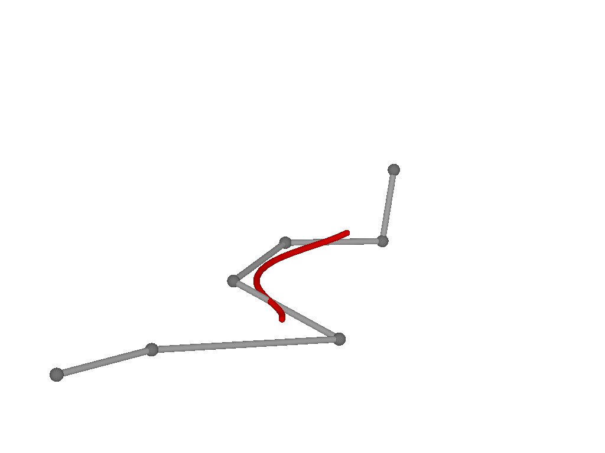

# BasicBSplineExporter

[BasicBSplineExporter.jl](https://github.com/hyrodium/BasicBSplineExporter.jl) supports export `BasicBSpline.BSplineManifold` and `BasicBSpline.CustomBSplineManifold{Dim,Deg,<:StaticVector}` to:
* PNG image (`.png`)
* SVG image (`.png`)
* POV-Ray mesh (`.inc`)

## Installation
```julia
] add https://github.com/hyrodium/BasicBSplineExporter.jl
```

## First example
```julia
using BasicBSpline
using BasicBSplineExporter
using StaticArrays

p = 2 # degree of polynomial
k1 = KnotVector(1:8)     # knot vector
k2 = KnotVector(rand(7))+(p+1)*KnotVector(1)
P1 = BSplineSpace{p}(k1) # B-spline space
P2 = BSplineSpace{p}(k2)
n1 = dim(P1) # dimension of B-spline space
n2 = dim(P2)
a = [SVector(2i-6.5+rand(),1.5j-6.5+rand()) for i in 1:dim(P1), j in 1:dim(P2)] # random generated control points
M = CustomBSplineManifold(a,(P1,P2)) # Define B-spline manifold
save_png("2dim.png", M) # save image
```


## Other examples
Here are some images rendared with POV-Ray.




See [`BasicBSplineExporter.jl/test`](https://github.com/hyrodium/BasicBSplineExporter.jl/tree/main/test) for more examples.
