# Mathematical properties of B-spline

## Introduction
[B-spline](https://en.wikipedia.org/wiki/B-spline) is a mathematical object, and it has a lot of application(e.g. [NURBS](https://en.wikipedia.org/wiki/Non-uniform_rational_B-spline), [IGA](https://en.wikipedia.org/wiki/Isogeometric_analysis)).

In this page, we'll explain the mathematical definition and property of B-spline with Julia code.

Before running the following code, do not forget importing the package:
```julia
using BasicBSpline
```

### Notice
* A book ["Geometric Modeling with Splines"](https://www.routledge.com/p/book/9780367447243) by Elaine Cohen, Richard F. Riesenfeld, Gershon Elber is really recommended.
* **Some of notations in this page are my original**, but these are well-considered results.

## Knot vector

!!! tip "Def.  Knot vector"
    A finite sequence
    ```math
    k = (k_1, \dots, k_l)
    ```
    is called **knot vector** if the sequence is broad monotonic increase, i.e. ``k_{i} \le k_{i+1}``.


[fig]

```julia
k = Knots([1,2,3])
k = Knots(1:3)
k = Knots(1,2,3)
```

We denotes a number of knots by *sharp* symbol like this:
```math
\sharp k = \sharp(k_1, \dots, k_l) =l
```

```julia
k = Knots([4,5,6])
♯(k) # 3
length(k) # 3
```

We introduce additional operator ``+`` and product operator ``\cdot``
```math
\begin{aligned}
k^{(1)}+k^{(2)}
&=(k^{(1)}_1, \dots, k^{(1)}_l) + (k^{(2)}_1, \dots, k^{(2)}_l) \\
&=(\text{sort of union of} \  k^{(1)} \ \text{and} \  k^{(2)} \text{)} \\
m\cdot k&=\underbrace{k+\cdots+k}_{m}
\end{aligned}
```
For example, ``(1,2,3)+(2,4,5)=(1,2,2,3,5)``, ``2\cdot (2,3)=(2,2,3,3)``.

```julia
Knots([1,2,3]) + Knots([2,4,5]) # Knots([1,2,2,3,5])
2 * Knots([2,3]) # Knots([2,2,3,3])
```

Deleting duplicates operator
```math
\begin{aligned}
\widehat{k}
&=(\text{remove duplicates of} \  k) \\
\end{aligned}
```
For example, ``\widehat{(1,2,2,3)}=(1,2,3)``.

```julia
unique(Knots([1,2,2,3])) # Knots([1,2,3])
```

For Given knot vector ``k``, the following function ``\mathfrak{n}_k:\mathbb{R}\to\mathbb{Z}`` represents the counts of ..

```math
\mathfrak{n}_k(t) = \sharp\{i \mid k_i=t \}
```
For example, if ``k=(1,2,2,3)``, then ``\mathfrak{n}_k(0.3)=0``, ``\mathfrak{n}_k(1)=1``, ``\mathfrak{n}_k(2)=2``.


```julia
k = Knots([1,2,2,3])
𝔫(k,0.3) # 0
𝔫(k,1.0) # 1
𝔫(k,2.0) # 2
```

## B-spline space
Before defining B-spline space, we'll define polynomial space with degree ``p``.

!!! tip "Def.  Polynomial space"
    Polynomial space with degree ``p``.
    ```math
    \mathcal{P}[p]
    =\left\{f:\mathbb{R}\to\mathbb{R}\ ;\ t\mapsto a_0+a_1t^1+\cdots+a_pt^p \  \left| \ %
        a_i\in \mathbb{R}
        \right.
    \right\}
    ```
    This space ``\mathcal{P}[p]`` is a ``p+1``-dimensional linear space.

Note that ``\{t\mapsto t^i\}_{0 \le i \le p}`` is a basis of ``\mathcal{P}[p]``, and also the set of [Bernstein polynomial](https://en.wikipedia.org/wiki/Bernstein_polynomial) ``\{B_{(i,p)}\}_i`` is a basis of ``\mathcal{P}[p]``.

```math
\begin{aligned}
B_{(i,p)}(t)
&=\binom{p}{i-1}t^{i-1}(1-t)^{p-i+1}
&(i=1, \dots, p+1)
\end{aligned}
```

Where ``\binom{p}{i-1}`` is a binomial coefficient.

!!! tip "Def.  B-spline space"
    For given polynomial degree ``p\ge 0`` and knot vector ``k=(k_1,\dots,k_l)``, B-spline space ``\mathcal{P}[p,k]`` is defined as follows:
    ```math
    \mathcal{P}[p,k]
    =\left\{f:\mathbb{R}\to\mathbb{R} \  \left| \ %
        \begin{gathered}
            \operatorname{supp}(f)\subseteq [k_1, k_l] \\
            \exists \tilde{f}\in\mathcal{P}[p], f|_{[k_{i}, k_{i+1})} = \tilde{f}|_{[k_{i}, k_{i+1})}  \\
            \forall t \in \mathbb{R}, \exists \delta > 0, f|_{(t-\delta,t+\delta)}\in C^{p-\mathfrak{n}_k(t)}
        \end{gathered} \right.
    \right\}
    ```

Note that a element of the space ``\mathcal{P}[p,k]`` is piecewise polynomial.

[fig]

```julia
p = 2
k = Knots([1,3,5,6,8,9])
BSplineSpace(p,k)
```

A B-spline space is said to be **proper** if its degree and knots satisfies following property:
```math
\begin{aligned}
k_{i}&<k_{i+p+1} & (1 \le i \le l-p-1)
\end{aligned}
```

```julia
isproper(BSplineSpace(2,Knots([1,3,5,6,8,9]))) # true
isproper(BSplineSpace(1,Knots([1,3,3,3,8,9]))) # false
```

The B-spline space is linear space, and if a B-spline space is proper, its dimension is calculated by:
```math
\dim(\mathcal{P}[p,k])=\sharp k -p -1
```

```julia
dim(BSplineSpace(2,Knots([1,3,5,6,8,9]))) # 3
```


## B-spline basis function
!!! tip "Def.  B-spline space"
    B-spline basis function is defined by [Cox–de Boor recursion formula](https://en.wikipedia.org/wiki/De_Boor%27s_algorithm).
    ```math
    \begin{aligned}
    {B}_{(i,p,k)}(t)
    &=
    \frac{t-k_{i}}{k_{i+p}-k_{i}}{B}_{(i,p-1,k)}(t)
    +\frac{k_{i+p+1}-t}{k_{i+p+1}-k_{i+1}}{B}_{(i+1,p-1,k)}(t) \\
    {B}_{(i,0,k)}(t)
    &=
    \begin{cases}
        &1\quad (k_{i}\le t< k_{i+1})\\
        &0\quad (\text{otherwise})
    \end{cases}
    \end{aligned}
    ```
    If the denominator is ..


!!! info "Thm.  Basis of B-spline space"
    The set of functions ``\{B_{(i,p,k)}\}_i`` is a basis of B-spline space ``\mathcal{P}[p,k]``.


```julia
using Plots
gr()
p = 2
k = Knots(1:8)
P = BSplineSpace(p,k)
plot([t->bsplinebasis₊₀(i,P,t) for i in 1:dim(P)], 1, 8, ylims=(0,1.05))
```

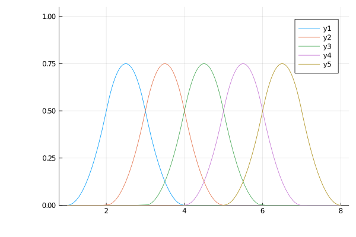

You can choose the first terms in different ways.

```math
\begin{aligned}
{B}_{(i,0,k)}(t)
&=
\begin{cases}
    &1\quad (k_{i} < t \le k_{i+1}) \\
    &0\quad (\text{otherwise})
\end{cases}
\end{aligned}
```

```julia
using Plots
gr()
p = 2
k = Knots(1:8)
P = BSplineSpace(p,k)
plot([t->bsplinebasis₋₀(i,P,t) for i in 1:dim(P)], 1, 8, ylims=(0,1.05))
```


## Support of B-spline basis function
!!! info "Thm.  Support of B-spline basis function"
    If a B-spline space``\mathcal{P}[p,k]`` is proper, the support of its basis function is calculated as follows:
    ```math
    \operatorname{supp}(B_{(i,p,k)})=[k_{i},k_{i+p+1}]
    ```

[fig]

```julia
i = 2
k = Knots([5,12,13,13,14])
p = 2
P = BSplineSpace(p,k)
bsplinesupport(P) # [5..13, 12..14]
bsplinesupport(i,P) # 12..14
```

## Derivative of B-spline basis function
!!! info "Thm.  Derivative of B-spline basis function"
    The derivative of B-spline basis function can be expressed as follows:
    ```math
    \begin{aligned}
    \dot{B}_{(i,p,k)}(t)
    &=\frac{d}{dt}B_{(i,p,k)}(t) \\
    &=p\left(\frac{1}{k_{i+p}-k_{i}}B_{(i,p-1,k)}(t)-\frac{1}{k_{i+p+1}-k_{i+1}}B_{(i+1,p-1,k)}(t)\right)
    \end{aligned}
    ```
    Note that ``\dot{B}_{(i,p,k)}\in\mathcal{P}[p-1,k]``.

```julia
using Plots
gr()
p = 2
k = Knots(1:8)
P = BSplineSpace(p,k)
plot([t->bsplinebasis′₊₀(i,P,t) for i in 1:dim(P)], 1, 8, ylims=(0,1.05))
```

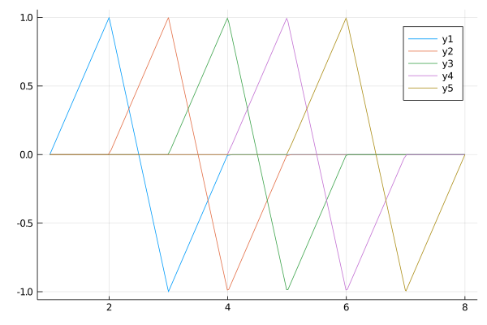

## Partition of unity
!!! info "Thm.  Partition of unity"
    ```math
    \begin{aligned}
    \sum_{i}B_{(i,p,k)}(t) &= 1 & (k_{p+1} \le t < k_{l-p}) \\
    0 \le B_{(i,p,k)}(t) &\le 1
    \end{aligned}
    ```

```julia
using Plots
gr()
p = 2
k = Knots(1:8)
P = BSplineSpace(p,k)
plot(t->sum(bsplinebasis₊₀(i,P,t) for i in 1:dim(P)), 1, 8, ylims=(0,1.05))
```

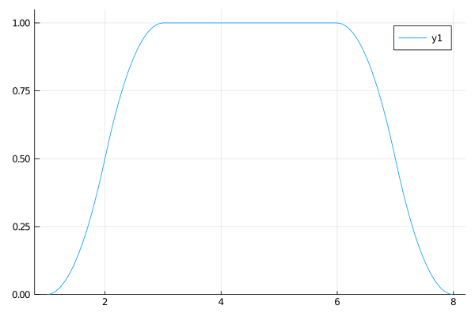

To satisfy the partition of unity on whole interval ``[1,8]``, sometimes more knots will be inserted to the endpoints of the interval.

```julia
using Plots
gr()
p = 2
k = Knots(1:8) + p * Knots([1,8])
P = BSplineSpace(p,k)
plot(t->sum(bsplinebasis₊₀(i,P,t) for i in 1:dim(P)), 1, 8, ylims=(0,1.05))
```

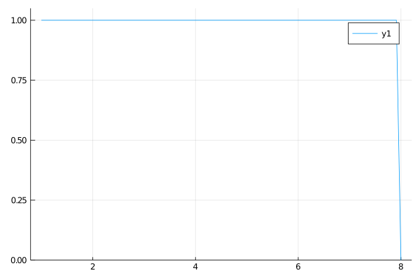

But, the sum ``\sum_{i} B_{(i,p,k)}(t)`` is not equal to ``1`` if ``t=8``.
Therefore, to satisfy partition of unity on closed interval ``[k_{p+1}, k_{l-p}]``, the definition of first terms of B-spline basis functions are sometimes replaced:

```math
\begin{aligned}
{B}_{(i,0,k)}(t)
&=
\begin{cases}
    &1\quad (k_{i} \le t<k_{i+1})\\
    &1\quad (k_{i} < t = k_{i+1}=k_{l})\\
    &0\quad (\text{otherwise})
\end{cases}
\end{aligned}
```

```julia
using Plots
gr()
p = 2
k = Knots(1:8) + p * Knots([1,8])
P = BSplineSpace(p,k)
plot(t->sum(bsplinebasis(i,P,t) for i in 1:dim(P)), 1, 8, ylims=(0,1.05))
```

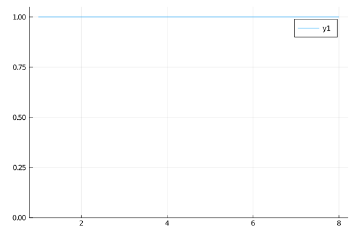


## Inclusion relation between B-spline spaces
!!! info "Thm.  Support of B-spline basis function"
    For proper B-spline spaces, the following relationship holds.
    ```math
    \mathcal{P}[p,k]
    \subseteq \mathcal{P}[p',k']
    \Leftrightarrow (m=p'-p \ge 0 \ \text{and} \ k+m\widehat{k}\subseteq k')
    ```

(as linear subspace..)

```julia
P1 = BSplineSpace(1,Knots([1,3,5,8]))
P2 = BSplineSpace(1,Knots([1,3,5,6,8,9]))
P3 = BSplineSpace(2,Knots([1,1,3,3,5,5,8,8]))
P1 ⊆ P2 # true
P1 ⊆ P3 # true
P2 ⊆ P3 # false
P2 ⊈ P3 # true
```

Here are plots of the B-spline basis functions of the spaces `P1`, `P2`, `P3`.

```julia
using Plots
gr()
P1 = BSplineSpace(1,Knots([1,3,5,8]))
P2 = BSplineSpace(1,Knots([1,3,5,6,8,9]))
P3 = BSplineSpace(2,Knots([1,1,3,3,5,5,8,8]))
plot(
    plot([t->bsplinebasis₊₀(i,P1,t) for i in 1:dim(P1)], 1, 9, ylims=(0,1.05), legend=false),
    plot([t->bsplinebasis₊₀(i,P2,t) for i in 1:dim(P2)], 1, 9, ylims=(0,1.05), legend=false),
    plot([t->bsplinebasis₊₀(i,P3,t) for i in 1:dim(P3)], 1, 9, ylims=(0,1.05), legend=false),
    layout=(3,1),
    link=:x
)
```

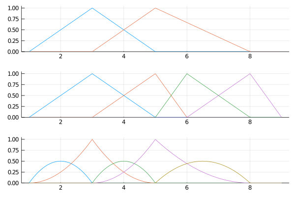

This means, there exists a ``n \times n'`` matrix ``A`` which holds:

```math
\begin{aligned}
B_{(i,p,k)}
&=\sum_{j}A_{ij} B_{(j,p',k')} \\
n&=\dim(\mathcal{P}[p,k]) \\
n'&=\dim(\mathcal{P}[p',k'])
\end{aligned}
```

You can calculate the change of basis matrix ``A`` with `changebasis`.

```julia
A12 = changebasis(P1,P2)
A13 = changebasis(P1,P3)
```

```julia
using Plots
gr()
plot(
    plot([t->bsplinebasis₊₀(i,P1,t) for i in 1:dim(P1)], 1, 9, ylims=(0,1.05), legend=false),
    plot([t->sum(A12[i,j]*bsplinebasis₊₀(j,P2,t) for j in 1:dim(P2)) for i in 1:dim(P1)], 1, 9, ylims=(0,1.05), legend=false),
    plot([t->sum(A13[i,j]*bsplinebasis₊₀(j,P3,t) for j in 1:dim(P3)) for i in 1:dim(P1)], 1, 9, ylims=(0,1.05), legend=false),
    layout=(3,1),
    link=:x
)
```

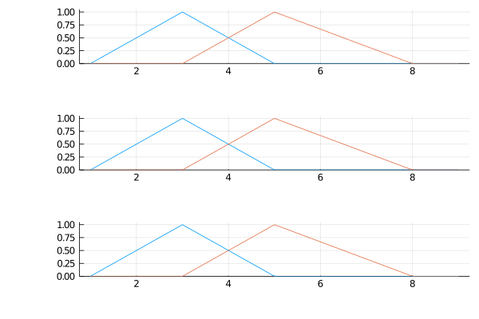

## Multi-dimensional B-spline
tensor product

```math
B_{i^1,\dots,i^d}(t^1,\dots,t^d)
=B_{(i^1,p^1,k^1)}(t^1)\cdots B_{(i^d,p^d,k^d)}(t^d)
```


## B-spline manifold
B-spline manifold is a parametric representation of a shape.

!!! tip "Def.  B-spline manifold"
    For given ``d``-dimensional B-spline basis functions ``B_{i^1,\dots,i^d}`` and given points ``\bm{a}_{i^1,\dots,i^d} \in \mathbb{R}^{\hat{d}}``, B-spline manifold is defined by following equality:
    ```math
    \bm{p}(t^1,\dots,t^d;\bm{a}_{i^1,\dots,i^d})
    =\sum_{i^1,\dots,i^d}B_{i^1,\dots,i^d}(t^1,\dots,t^d) \bm{a}_{i^1,\dots,i^d}
    ```
    Where ``\bm{a}_{i^1,\dots,i^d}`` are called **control points**.

We will also write ``\bm{p}(t^1,\dots,t^d; \bm{a})``, ``\bm{p}(t^1,\dots,t^d)``, ``\bm{p}(t; \bm{a})`` or ``\bm{p}(t)`` for simplicity.

```julia
P1 = BSplineSpace(1,Knots([0,0,1,1]))
P2 = BSplineSpace(1,Knots([1,1,2,3,3]))
n1 = dim(P1) # 2
n2 = dim(P2) # 3
a = [[i, j] for i in 1:n1, j in 1:n2]  # n1 × n2 array of d̂ array.
M = BSplineManifold([P1, P2], a)
```


### B-spline curve
```julia
## 1-dim B-spline manifold
p = 2 # degree of polynomial
k = Knots(1:12) # knot vector
P = FastBSplineSpace(p, k) # B-spline space
a = [[i-5, 3*sin(i^2)] for i in 1:dim(P)] # control points
M = BSplineCurve([P], a) # Define B-spline manifold
save_png("1dim.png", M, unitlength = 50)
```
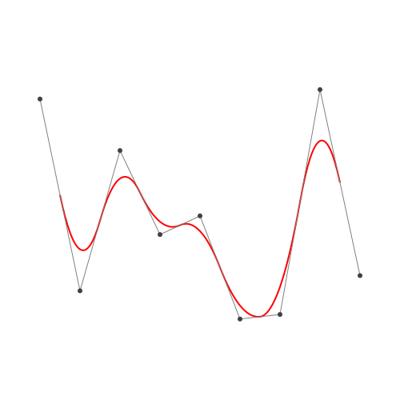


### B-spline surface
```julia
p = 2 # degree of polynomial
k = Knots(1:8) # knot vector
P = BSplineSpace(p,k) # B-spline space
rand_a = [rand(2) for i in 1:dim(P), j in 1:dim(P)]
a = [[2*i-6.5,2*j-6.5] for i in 1:dim(P), j in 1:dim(P)] + rand_a # random generated control points
M = BSplineManifold([P,P],a) # Define B-spline manifold
save_png("2dim.png", M) # save image
```


```julia
points = [M([u,v]) for u in range(3.0,6.0,length=50), v in range(3.0,6.0,length=50)]
X = [point[1] for point in points]
Y = [point[2] for point in points]
scene = Scene(resolution=(1000,1000))
Makie.surface!(X,Y)
Makie.xlims!(-5,5)
Makie.ylims!(-5,5)
save("2dim_makie.png", scene)
```

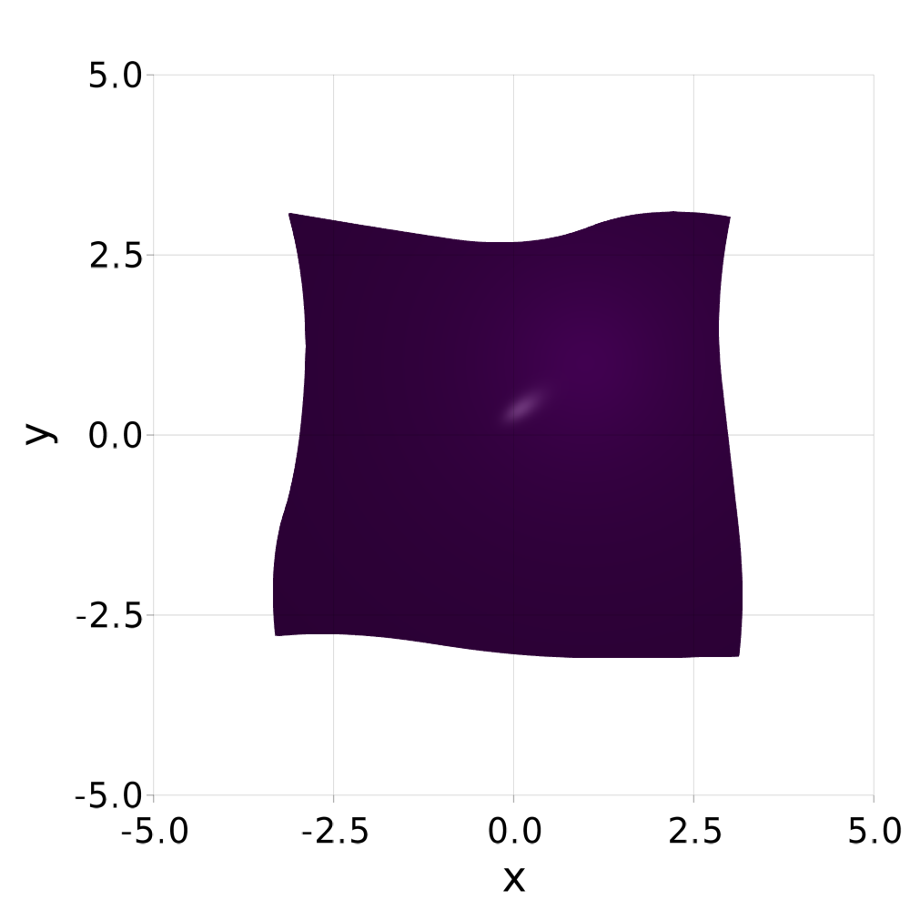

## Affine commutativity
!!! info "Thm.  Affine commutativity"
    If ``T`` is a affine transform ``\mathbb{R}^d\to\mathbb{R}^d``, then the following equality holds.
    ```math
    T(\bm{p}(t; \bm{a}))
    =\bm{p}(t; T(\bm{a}))
    ```

## Refinement
```julia
k₊=[Knots(3.3,4.2),Knots(3.8,3.2,5.3)] # additional knots
M′ = refinement(M,k₊=k₊) # refinement of B-spline manifold
save_png("2dim_refinement.png", M′) # save image
```
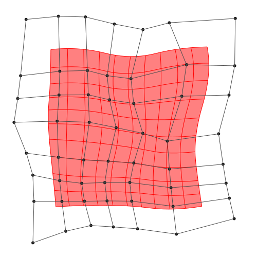

Note that this shape and the last shape are identical.

### h-refinemnet
Insert additional knots to knot vector.


### p-refinemnet
Increase the polynomial degree of B-spline manifold.


## Fitting
Least squares method.

[Try on Desmos graphing graphing calculator!](https://www.desmos.com/calculator/2hm3b1fbdf)
```julia
p1 = 2
p2 = 2
k1 = Knots(-10:10)+p1*Knots(-10,10)
k2 = Knots(-10:10)+p2*Knots(-10,10)
P1 = FastBSplineSpace(p1, k1)
P2 = FastBSplineSpace(p2, k2)

f(u1, u2) = [2u1+sin(u1)+cos(u2)+u2/2, 3u2+sin(u2)+sin(u1)/2+u1^2/6]/5

a = fittingcontrolpoints(f, P1, P2)
M = BSplineManifold([P1,P2],a)
save_png("fitting.png", M, unitlength=50, up=10, down=-10, left=-10, right=10)
```

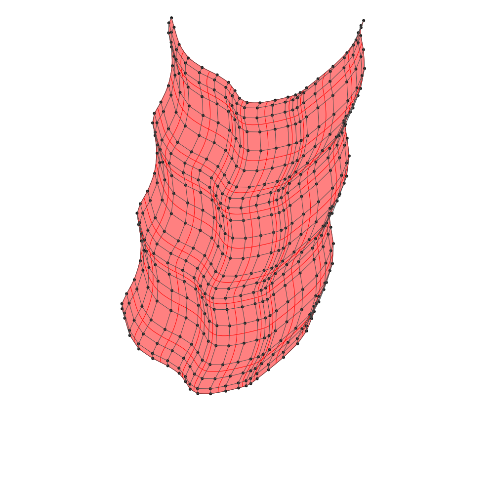
