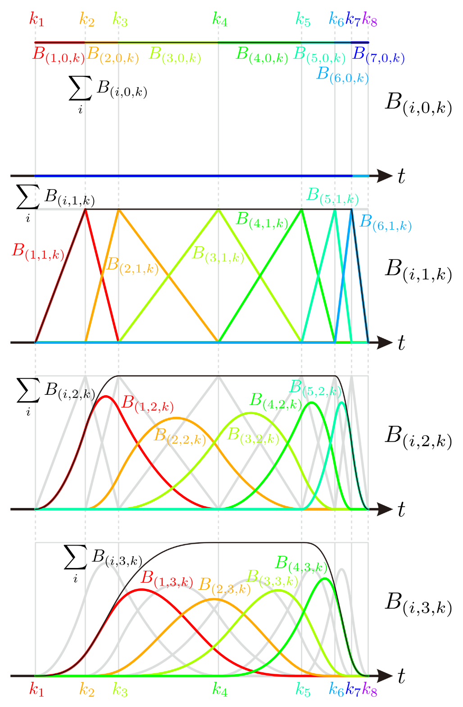

# B-spline basis function

## Setup

```@example math_bsplinebasis
using BasicBSpline
using Random
using Plots
```

## Basic properties of B-spline basis function

!!! tip "Def.  B-spline space"
    B-spline basis function is defined by [Cox–de Boor recursion formula](https://en.wikipedia.org/wiki/De_Boor%27s_algorithm).
    ```math
    \begin{aligned}
    {B}_{(i,p,k)}(t)
    &=
    \frac{t-k_{i}}{k_{i+p}-k_{i}}{B}_{(i,p-1,k)}(t)
    +\frac{k_{i+p+1}-t}{k_{i+p+1}-k_{i+1}}{B}_{(i+1,p-1,k)}(t) \\
    {B}_{(i,0,k)}(t)
    &=
    \begin{cases}
        &1\quad (k_{i}\le t< k_{i+1})\\
        &0\quad (\text{otherwise})
    \end{cases}
    \end{aligned}
    ```
    If the denominator is zero, then the term is assumed to be zero.

The next figure shows the plot of B-spline basis functions.
You can manipulate these plots on [desmos graphing calculator](https://www.desmos.com/calculator/ql6jqgdabs)!



!!! info "Thm.  Basis of B-spline space"
    The set of functions ``\{B_{(i,p,k)}\}_i`` is a basis of B-spline space ``\mathcal{P}[p,k]``.

These B-spline basis functions can be calculated with [`bsplinebasis₊₀`](@ref).

```@example math_bsplinebasis
p = 2
k = KnotVector([0.0, 1.5, 2.5, 5.5, 8.0, 9.0, 9.5, 10.0])
P = BSplineSpace{p}(k)
gr()
plot([t->bsplinebasis₊₀(P,i,t) for i in 1:dim(P)], 0, 10, ylims=(0,1), label=false)
savefig("bsplinebasisplot.png") # hide
nothing # hide
```


The first terms can be defined in different ways ([`bsplinebasis₋₀`](@ref)).

```math
\begin{aligned}
{B}_{(i,0,k)}(t)
&=
\begin{cases}
    &1\quad (k_{i} < t \le k_{i+1}) \\
    &0\quad (\text{otherwise})
\end{cases}
\end{aligned}
```

```@example math_bsplinebasis
p = 2
k = KnotVector([0.0, 1.5, 2.5, 5.5, 8.0, 9.0, 9.5, 10.0])
P = BSplineSpace{p}(k)
plot([t->bsplinebasis₋₀(P,i,t) for i in 1:dim(P)], 0, 10, ylims=(0,1), label=false)
savefig("bsplinebasisplot2.png") # hide
nothing # hide
```


In these cases, each B-spline basis function ``B_{(i,2,k)}`` is coninuous, so [`bsplinebasis₊₀`](@ref) and [`bsplinebasis₋₀`](@ref) are equal.

## Support of B-spline basis function
!!! info "Thm.  Support of B-spline basis function"
    If a B-spline space``\mathcal{P}[p,k]`` is non-degenerate, the support of its basis function is calculated as follows:
    ```math
    \operatorname{supp}(B_{(i,p,k)})=[k_{i},k_{i+p+1}]
    ```

[`bsplinesupport`](@ref) returns this interval set.

```@example math_bsplinebasis
p = 2
k = KnotVector([0.0, 1.5, 2.5, 5.5, 8.0, 9.0, 9.5, 10.0])
P = BSplineSpace{p}(k)

pl1 = plot([t->bsplinebasis₋₀(P,i,t) for i in 1:dim(P)], 0, 10, ylims=(0,1), label=false)
pl2 = plot(; yticks=nothing, legend=nothing)
for i in 1:dim(P)
    plot!(pl2, bsplinesupport(P,i); offset=-i/10, linewidth=3, markersize=5, ylims=(-(dim(P)+1)/10, 1/10))
end
plot!(pl2, k; color=:black)
plot(pl1, pl2; layout=grid(2, 1, heights=[0.8 ,0.2]), link=:x)
savefig("bsplinesupport.png") # hide
nothing # hide
```


[`bsplinesupport_R`](@ref) is the same as [`bsplinesupport`](@ref).

```@example math_bsplinebasis
pl = plot(; yticks=nothing, legend=nothing, size=(600,150))
for i in 1:dim(P)
    plot!(pl, bsplinesupport_R(P,i); offset=-i/10, linewidth=3, markersize=5, ylims=(-(dim(P)+1)/10, 1/10))
end
plot!(pl, k; color=:black)
savefig("bsplinesupport_R.png") # hide
nothing # hide
```


However, [`bsplinesupport_I`](@ref) is different from [`bsplinesupport`](@ref).
It returns ``[k_i,k_{i+p}] \cap [k_{1+p},k_{l-p}]`` instead.

```@example math_bsplinebasis
pl = plot(; yticks=nothing, legend=nothing, size=(600,150))
for i in 1:dim(P)
    plot!(pl, bsplinesupport_I(P,i); offset=-i/10, linewidth=3, markersize=5, ylims=(-(dim(P)+1)/10, 1/10))
end
plot!(pl, k; color=:black)
savefig("bsplinesupport_I.png") # hide
nothing # hide
```


```@repl math_bsplinebasis
bsplinesupport(P,1), bsplinesupport_R(P,1), bsplinesupport_I(P,1)
bsplinesupport(P,3), bsplinesupport_R(P,3), bsplinesupport_I(P,3)
```

## Partition of unity
!!! info "Thm.  Partition of unity"
    Let ``B_{(i,p,k)}`` be a B-spline basis function, then the following equation is satisfied.
    ```math
    \begin{aligned}
    \sum_{i}B_{(i,p,k)}(t) &= 1 & (k_{p+1} \le t < k_{l-p}) \\
    0 \le B_{(i,p,k)}(t) &\le 1
    \end{aligned}
    ```

```@example math_bsplinebasis
p = 2
k = KnotVector([0.0, 1.5, 2.5, 5.5, 8.0, 9.0, 9.5, 10.0])
P = BSplineSpace{p}(k)
plot(t->sum(bsplinebasis₊₀(P,i,t) for i in 1:dim(P)), 0, 10, ylims=(-0.1, 1.1), label="sum of bspline basis functions")
plot!(k, label="knot vector", legend=:inside)
savefig("sumofbsplineplot.png") # hide
nothing # hide
```


To satisfy the partition of unity on whole interval ``[0,10]``, sometimes more knots will be inserted to the endpoints of the interval.

```@example math_bsplinebasis
p = 2
k = KnotVector([0.0, 1.5, 2.5, 5.5, 8.0, 9.0, 9.5, 10.0]) + p * KnotVector([0,10])
P = BSplineSpace{p}(k)
plot(t->sum(bsplinebasis₊₀(P,i,t) for i in 1:dim(P)), 0, 10, ylims=(-0.1, 1.1), label="sum of bspline basis functions")
plot!(k, label="knot vector", legend=:inside)
savefig("sumofbsplineplot2.png") # hide
nothing # hide
```


But, the sum ``\sum_{i} B_{(i,p,k)}(t)`` is not equal to ``1`` at ``t=8``.
Therefore, to satisfy partition of unity on closed interval ``[k_{p+1}, k_{l-p}]``, the definition of first terms of B-spline basis functions are sometimes replaced:

```math
\begin{aligned}
{B}_{(i,0,k)}(t)
&=
\begin{cases}
    &1\quad (k_{i} \le t<k_{i+1})\\
    &1\quad (k_{i} < t = k_{i+1}=k_{l})\\
    &0\quad (\text{otherwise})
\end{cases}
\end{aligned}
```

```@example math_bsplinebasis
p = 2
k = KnotVector([0.0, 1.5, 2.5, 5.5, 8.0, 9.0, 9.5, 10.0]) + p * KnotVector([0,10])
P = BSplineSpace{p}(k)
plot(t->sum(bsplinebasis(P,i,t) for i in 1:dim(P)), 0, 10, ylims=(-0.1, 1.1), label="sum of bspline basis functions")
plot!(k, label="knot vector", legend=:inside)
savefig("sumofbsplineplot3.png") # hide
nothing # hide
```


Here are all of valiations of the B-spline basis function.

* [`bsplinebasis₊₀`](@ref)
* [`bsplinebasis₋₀`](@ref)
* [`bsplinebasis`](@ref)
* [`BasicBSpline.bsplinebasis₋₀I`](@ref)

## [Differentiability and knot duplications](@id differentiability-and-knot-duplications)

The differentiability of the B-spline basis function depends on the duplications on the knot vector.

The following animation shows this property.

```@example math_bsplinebasis
# Initialize
gr()
Random.seed!(42)
N = 10

# Easing functions
c=2/√3
f(t) = ifelse(t>0, exp(-1/t), 0.0)
g(t) = 1 - f(c*t) / (f(c*t) + f(c-c*t))
h(t) = clamp(1 - f((1-t)/2) / f(1/2), 0, 1)

# Default knot vector
v = 10*(1:N-1)/N + randn(N-1)*0.5
pushfirst!(v, 0)
push!(v, 10)

# Generate animation
anim = @animate for t in 0:0.05:5
    w = copy(v)
    w[5] = v[4] + (g(t-0.0) + h(t-3.9)) * (v[5]-v[4])
    w[6] = v[4] + (g(t-1.0) + h(t-3.6)) * (v[6]-v[4])
    w[7] = v[4] + (g(t-2.0) + h(t-3.3)) * (v[7]-v[4])
    k = KnotVector(w)
    P0 = BSplineSpace{0}(k)
    P1 = BSplineSpace{1}(k)
    P2 = BSplineSpace{2}(k)
    P3 = BSplineSpace{3}(k)
    plot(
        plot(P0; label="P0", ylims=(0,1), color=palette(:cool,4)[1]),
        plot(P1; label="P1", ylims=(0,1), color=palette(:cool,4)[2]),
        plot(P2; label="P2", ylims=(0,1), color=palette(:cool,4)[3]),
        plot(P3; label="P3", ylims=(0,1), color=palette(:cool,4)[4]),
        plot(k; label="knot vector", ylims=(-0.1,0.02), color=:white, yticks=nothing);
        layout=grid(5, 1, heights=[0.23 ,0.23, 0.23, 0.23, 0.08]),
        size=(501,800)
    )
end

# Run ffmepg to generate mp4 file
# cmd = `ffmpeg -y -framerate 24 -i $(anim.dir)/%06d.png -c:v libx264 -pix_fmt yuv420p differentiability.mp4`
cmd = `ffmpeg -y -framerate 24 -i $(anim.dir)/%06d.png -c:v libx264 -pix_fmt yuv420p differentiability.mp4` # hide
out = Pipe() # hide
err = Pipe() # hide
run(pipeline(ignorestatus(cmd), stdout=out, stderr=err)) # hide
nothing # hide
```


## B-spline basis functions at specific point
Sometimes, you may need the non-zero values of B-spline basis functions at specific point.
The [`bsplinebasisall`](@ref) function is much more efficient than evaluating B-spline functions one by one with [`bsplinebasis`](@ref) function.

```@example math_bsplinebasis
P = BSplineSpace{2}(KnotVector([0.0, 1.5, 2.5, 5.5, 8.0, 9.0, 9.5, 10.0]))
t = 6.3
plot(P; label="P", ylims=(0,1))
scatter!(fill(t,3), [bsplinebasis(P,2,t), bsplinebasis(P,3,t), bsplinebasis(P,4,t)]; markershape=:circle, markersize=10, label="bsplinebasis")
scatter!(fill(t,3), bsplinebasisall(P, 2, t); markershape=:star7, markersize=10, label="bsplinebasisall")
savefig("bsplinebasis_vs_bsplinebasisall.png") # hide
nothing # hide
```


Benchmark:

```@repl
using BenchmarkTools, BasicBSpline
P = BSplineSpace{2}(KnotVector([0.0, 1.5, 2.5, 5.5, 8.0, 9.0, 9.5, 10.0]))
t = 6.3
(bsplinebasis(P, 2, t), bsplinebasis(P, 3, t), bsplinebasis(P, 4, t))
bsplinebasisall(P, 2, t)
@benchmark (bsplinebasis($P, 2, $t), bsplinebasis($P, 3, $t), bsplinebasis($P, 4, $t))
@benchmark bsplinebasisall($P, 2, $t)
```

The next figures illustlates the relation between `domain(P)`, `intervalindex(P,t)` and `bsplinebasisall(P,i,t)`.

```@example math_bsplinebasis
plotly()
k = KnotVector([0.0, 1.5, 2.5, 5.5, 8.0, 9.0, 9.5, 10.0])

for p in 1:3
    local P
    P = BSplineSpace{p}(k)
    plot(P, legend=:topleft, label="B-spline basis (p=1)")
    plot!(t->intervalindex(P,t),0,10, label="Interval index")
    plot!(t->sum(bsplinebasis(P,i,t) for i in 1:dim(P)),0,10, label="Sum of B-spline basis")
    plot!(domain(P); label="domain")
    plot!(k; label="knot vector")
    plot!([t->bsplinebasisall(P,1,t)[i] for i in 1:p+1],0,10, color=:black, label="bsplinebasisall (i=1)", ylim=(-1,8-2p))
    savefig("bsplinebasisall-$(p).html") # hide
    nothing # hide
end
```

```@raw html
<object type="text/html" data="../bsplinebasisall-1.html" style="width:100%;height:420px;"></object>
```

```@raw html
<object type="text/html" data="../bsplinebasisall-2.html" style="width:100%;height:420px;"></object>
```

```@raw html
<object type="text/html" data="../bsplinebasisall-3.html" style="width:100%;height:420px;"></object>
```

## Uniform B-spline basis and uniform distribution

Let ``X_1, \dots, X_n`` be i.i.d. random variables with ``X_i \sim U(0,1)``, then the probability density function of ``X_1+\cdots+X_n`` can be obtained via `BasicBSpline.uniform_bsplinebasis_kernel(Val(n-1),t)`.

```@example math_bsplinebasis
gr()
N = 100000
# polynomial degree 0
plot1 = histogram([rand() for _ in 1:N], normalize=true, label=false)
plot!(t->BasicBSpline.uniform_bsplinebasis_kernel(Val(0),t), label=false)
# polynomial degree 1
plot2 = histogram([rand()+rand() for _ in 1:N], normalize=true, label=false)
plot!(t->BasicBSpline.uniform_bsplinebasis_kernel(Val(1),t), label=false)
# polynomial degree 2
plot3 = histogram([rand()+rand()+rand() for _ in 1:N], normalize=true, label=false)
plot!(t->BasicBSpline.uniform_bsplinebasis_kernel(Val(2),t), label=false)
# polynomial degree 3
plot4 = histogram([rand()+rand()+rand()+rand() for _ in 1:N], normalize=true, label=false)
plot!(t->BasicBSpline.uniform_bsplinebasis_kernel(Val(3),t), label=false)
# plot all
plot(plot1,plot2,plot3,plot4)
savefig("histogram-uniform.png") # hide
nothing # hide
```


